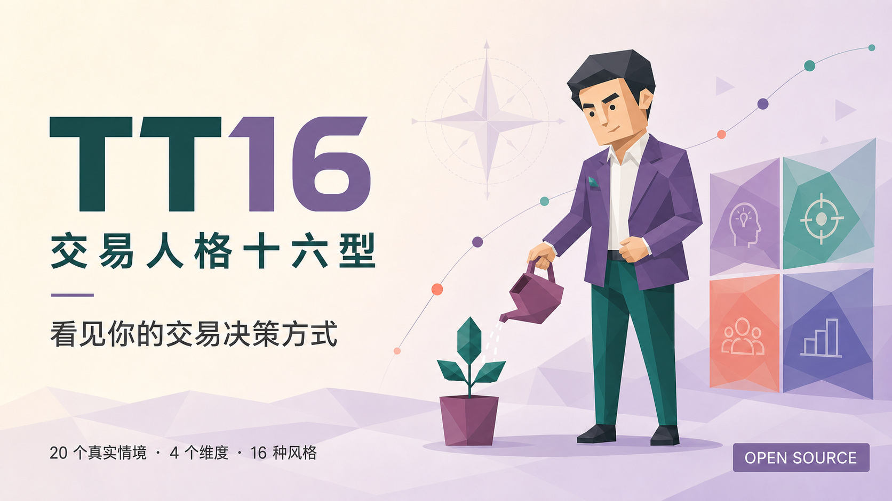
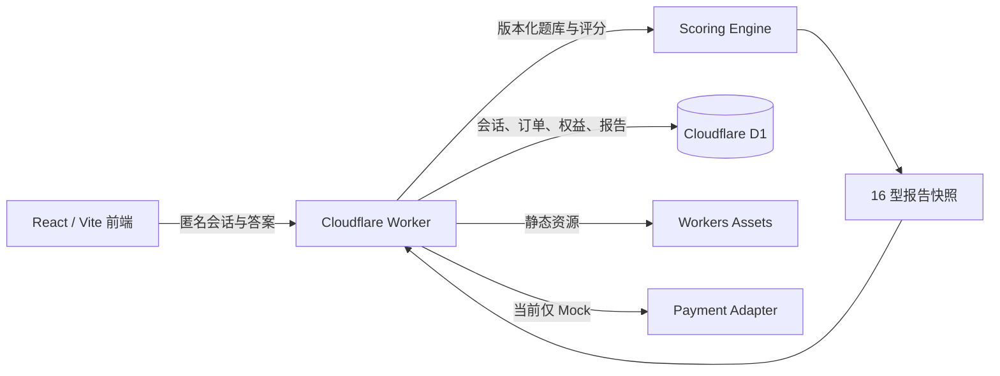

<div align="center">

# TT16 · TradeType 16

**交易人格十六型：把真实交易选择，整理成一张可复盘的决策地图。**

[GitHub Pages 免费体验](https://wzxsph.github.io/TT16/) · [参与贡献](CONTRIBUTING.md) · [安全策略](SECURITY.md) · [第三方声明](THIRD_PARTY_NOTICES.md)

> GitHub Pages 版 20 题和完整报告全部免费，纯静态运行，答案仅在当前浏览器评分，没有支付、订单或解锁流程。

> **维护状态：** 这个公开版本已进入维护冻结，只继续接收安全更新、依赖修复、明确缺陷、可访问性和文档更正。快速猜型、微信小程序及其他后续产品功能不进入本公开仓库。

</div>



## TT16 是什么？

TT16 是一个开源、移动端优先的交易行为人格项目。用户回答 20 个贴近真实决策的情境题，系统从四组连续维度观察稳定倾向，并组合成 16 种交易风格。完整报告会解释优势、盲点、压力反应、适配环境和可执行的复盘守则。

我们借用了“十六型人格”容易理解、容易传播的表达方式，但不想把交易者贴成简单标签。TT16 更关心四个具体问题：

| 维度 | 左侧倾向 | 右侧倾向 | 我们在观察什么 |
| --- | --- | --- | --- |
| R / S | Research · 研究 | Signal · 信号 | 观点主要从企业价值还是市场反馈形成 |
| H / T | Hold · 持有 | Trade · 交易 | 更愿意等待逻辑兑现，还是捕捉阶段机会 |
| D / A | Defensive · 防守 | Aggressive · 进攻 | 更重视风险预算，还是集中表达确信度 |
| P / F | Planned · 计划 | Flexible · 灵活 | 更依赖预设规则，还是随新信息调整 |

维度没有高低，类型也不代表收益能力。它们只是描述“你通常怎样做决定”，帮助你发现一种优势在过度使用时可能变成什么盲点。

## 在线体验

**免费静态版：** [wzxsph.github.io/TT16](https://wzxsph.github.io/TT16/)

- 测试约 3–5 分钟，无需注册，不连接券商账户；
- 20 题与完整报告全部免费，没有付费墙和支付界面；
- 答案、评分和进度只保存在当前浏览器，不调用后端 API；
- 人格卡在浏览器本地绘制，可导出 1:1 与 9:16 高清图片。

**Cloudflare 商业架构沙盒：** [tt16-commercial-sandbox.samsong-1a3.workers.dev](https://tt16-commercial-sandbox.samsong-1a3.workers.dev)

该地址保留 Worker、D1、订单和 Mock 支付适配层，仅用于公开展示商业架构；不会产生真实扣款。

## 16 种交易人格

第二版人格插画使用统一的低多边形语言、更简洁的主题道具与适中头身比，保留每一类型的独立识别度。


## 最终人格卡

人格卡预览和下载现在共用同一个 Canvas 绘制器，不再出现“预览完整、导出裁切”的差异。人物插画使用完整适配，长副标题自动换行，姓名、人格代码与四维数值都保留在安全区内。下图是当前程序实际生成的「复利园丁」卡片：

| 1:1 方形卡 | 9:16 故事卡 |
| --- | --- |
|  |  |

## 为什么做这个项目？

交易复盘常被简化成“这笔赚了还是亏了”，但一次结果无法说明决策过程是否可靠。我们希望做一个更轻、更友好的入口：先让用户认出自己的稳定模式，再把抽象提醒翻译成具体动作。

TT16 坚持几条产品原则：

- **描述偏好，不评判能力。** 研究不天然等于理性，灵活也不天然等于冲动；
- **优势与盲点成对出现。** 每个报告都展示一种力量过度使用后的另一面；
- **从标签回到行动。** 报告最终落在可以记录、执行和复盘的守则上；
- **人格与适当性分开。** 不收集收入、负债、持仓或风险承受能力，不输出投资适当性结论；
- **不荐股，不承诺收益。** 项目不连接券商，不给出证券、仓位或买卖建议。

## 已实现能力

- GitHub Pages 免费静态版：本地评分、完整报告，不包含 API、订单或支付运行时；
- 20 道版本化商业题库、四维计分、质量门与 16 型报告快照；
- Cloudflare Worker 服务端评分，前端无法自行指定分数或人格类型；
- 匿名 session、逐题同步、刷新恢复和订单凭证恢复；
- 付费前不下发人格代码、称号、维度或报告正文；
- 服务端定价、幂等订单、Mock 支付、唯一权益和高熵报告 token；
- 退款后撤销权益与访问 token，支持售后和数据权利工单；
- CSP、HSTS、来源校验、输入限制、速率限制和 D1 健康检查；
- 单元测试、Worker 类型检查与完整商业 API 验收。

## 技术架构



主要技术栈：React 19、TypeScript、Vite、Cloudflare Workers、D1、Wrangler、Vitest。

## 本地运行

需要 Node.js 22+ 和 npm。

```bash
git clone https://github.com/wzxsph/TT16.git
cd TT16
npm ci
npm run db:migrate:local
npm run dev:commercial
```

默认访问地址为 `http://127.0.0.1:8787`。本地配置使用本地 D1、`APP_ENV=local` 与 `PAYMENT_MODE=mock`。

常用检查命令：

```bash
npm run build
npm run build:pages
npm run test:pages-build
npm run typecheck:worker
npm test -- --run
npm run test:api:commercial
npm audit --audit-level=high
```

## 目录导览

```text
src/                         React 页面、题库、画像和评分客户端
worker/index.ts              Cloudflare Worker 商业 API
migrations/                  D1 顺序迁移
public/images/               线上使用的 16 型 WebP 插画
design/personality-masters/  人格插画 PNG 母版与设计资产
docs/images/                 README 宣传图、16 型总览与真实人格卡
scripts/                     资产处理与 API 验收脚本
ops/                         沙盒发布、监控与运维材料
prd/                         产品需求文档
```

## Cloudflare 沙盒部署

`wrangler.sandbox.jsonc` 指向独立沙盒 Worker 与 D1。部署前需要在自己的 Cloudflare 账户创建 D1，并替换配置中的 `database_id` 与域名：

```bash
npm run db:migrate:sandbox
npm run deploy:sandbox
```

部署后，`/api/health` 应返回 `environment=sandbox`、`paymentMode=mock` 和 `commerce=true`。项目会拒绝 `production + mock` 组合；真实支付必须使用独立生产配置、正式回调验签和 Cloudflare Secrets。

## 参与贡献

欢迎参与安全修复、现有功能缺陷、内容勘误、可访问性、测试和文档维护。公开版不再接收快速猜型、新测试模式、新客户端或其他产品扩展。请先阅读 [CONTRIBUTING.md](CONTRIBUTING.md)，再从 [Issue 模板](https://github.com/wzxsph/TT16/issues/new/choose) 选择合适入口；安全问题不要创建公开 Issue，请按 [SECURITY.md](SECURITY.md) 私下报告。

贡献时请特别保护三条边界：付费前不泄露结果、评分与价格以 Worker 为准、任何页面都不得暗示收益或提供投资建议。

## 维护范围

- 修复高危依赖、安全漏洞和构建失效；
- 修复现有 20 题、报告、分享卡和沙盒中的可复现缺陷；
- 接受不改变产品边界的可访问性、兼容性与文档更正；
- 不增加快速猜型、新测试模式、新客户端、付费能力或其他产品功能。

## 许可证

本项目由 `wzxsph` 以 [GNU Affero General Public License v3.0 only](LICENSE)（`AGPL-3.0-only`）发布。你可以商用、修改和再分发；分发修改版或通过网络向用户提供修改版服务时，必须按许可证向相应用户提供对应源码。第三方依赖仍遵循各自许可证，见 [THIRD_PARTY_NOTICES.md](THIRD_PARTY_NOTICES.md)。

## 免责声明

TT16 是行为自我观察与娱乐项目，不构成证券投资建议、收益承诺、风险承受能力评估、心理诊断或任何金融产品推荐。市场有风险，投资决策应结合个人财务状况、投资目标与独立判断。
