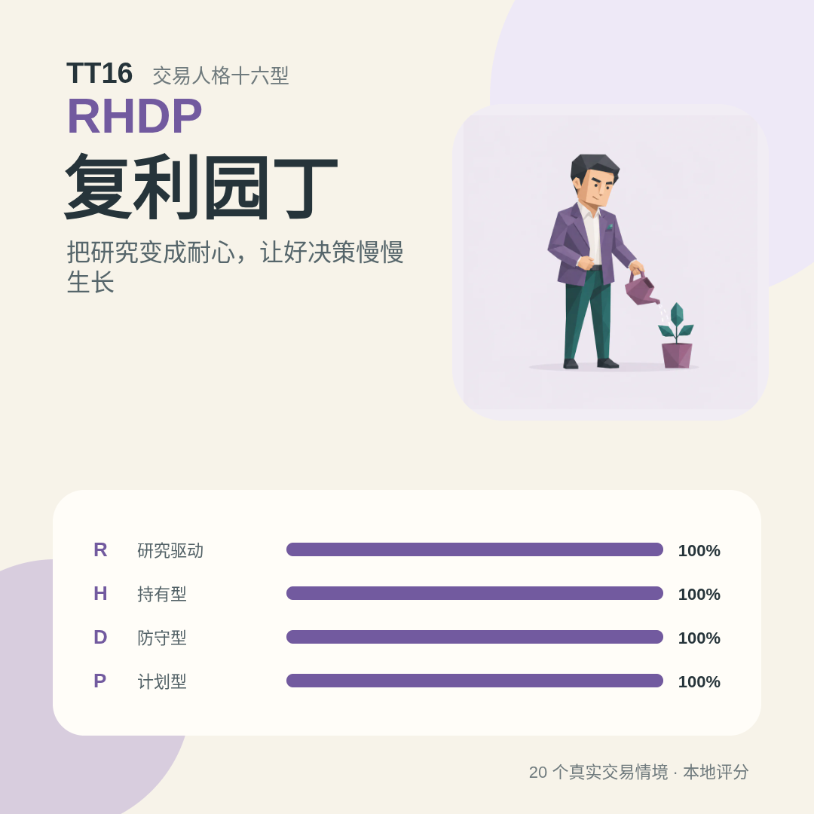
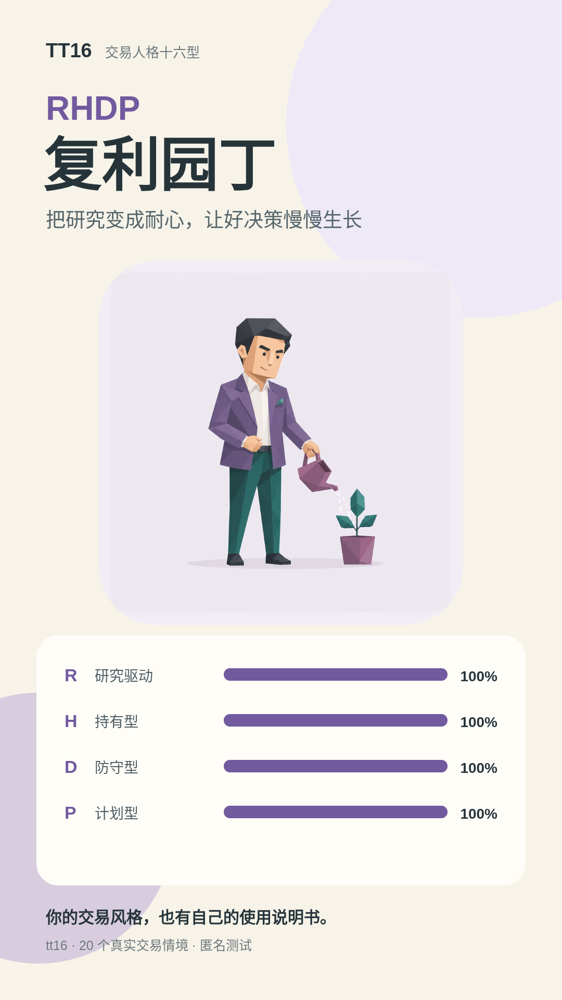
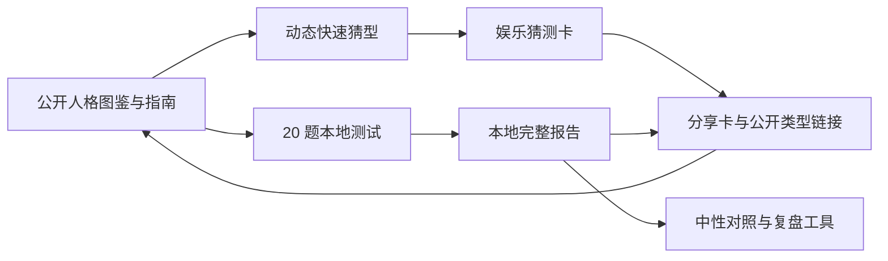

<div align="center">

# TT16 · TradeType 16

**20 个真实交易情境，认识你的判断、周期、风险表达与执行方式。**

[GitHub Pages 免费镜像](https://wzxsph.github.io/TT16/) · [内容素材包](docs/CONTENT_KIT.md) · [参与贡献](CONTRIBUTING.md) · [安全策略](SECURITY.md)

> 全部内容永久免费。本地评分与本地猜型，不注册、不上传逐题答案、不连接券商账户，也没有订单、支付或解锁接口。

</div>


## 现在的 TT16

TT16 是一个开源、移动端优先的交易行为人格项目。标准 20 题会生成四组连续维度和一种便于阅读的四字母类型；独立的“快速猜型”会根据前面回答动态选择问题，在内部证据足够时询问“你更像这个类型吗”。报告把自然优势与过度使用成对呈现，并给出压力重置动作、协作提醒和可观察的复盘守则。

它描述“通常怎样做决定”，不评价投资能力，不预测收益，不测风险承受能力，也不构成证券建议或心理诊断。

| 维度 | 左侧倾向 | 右侧倾向 | 观察的问题 |
| --- | --- | --- | --- |
| R / S | Research · 研究 | Signal · 信号 | 观点主要从企业事实还是市场反馈形成 |
| H / T | Hold · 持有 | Trade · 交易 | 更愿意等待逻辑兑现，还是使用较短反馈周期 |
| D / A | Defensive · 防守 | Aggressive · 进攻 | 更强调限制单点影响，还是集中表达确信度 |
| P / F | Planned · 计划 | Flexible · 灵活 | 更依赖事前规则，还是根据信息及时调整 |

每一端都有适用环境与过度使用的风险。类型没有高低，也不代表适合某只证券、某种仓位或某类产品。

## 免费内容产品

- 20 题本地测试、完整报告与刷新恢复；
- 200 条原创情境驱动的纯本地快速猜型与娱乐卡片；
- 16 型公开人格图鉴、4 个族群页和 4 个维度页；
- 每型关键词、决策循环、优势/盲点、环境、压力重置、五条守则、复盘问题、协作提示与常见误解；
- 120 组无序类型的中性对照，不生成匹配分、最佳搭档或能力排名；
- 6 篇方法指南和一项不收集自由文本的五分钟复盘工具；
- 每型 A4 打印单页、1:1 与 9:16 本地分享卡、1200×630 Open Graph 图片；
- [16 条人格传播文案、4 条族群文案和长中短项目介绍](docs/CONTENT_KIT.md)。

| 1:1 方形卡 | 9:16 故事卡 |
| --- | --- |
|  |  |

## 产品闭环

TT16 采用“公开图鉴 → 快速猜型或标准测试 → 本地结果 → 社交分享 → 回到公开内容”的内容闭环。结构上借鉴公开人格内容产品的易浏览与易分享方式，但题目、类型、文案、评分、猜型策略和低多边形视觉均为 TT16 自有内容。



## 隐私、统计与广告边界

- 浏览器使用 `tt16:assessment:v2` 保存正式测试，使用独立的 `tt16:guess:v1` 保存快速猜型轨迹，并安全迁移 `tt16:free:v1`；损坏数据会回退，不会上传答案。
- `/guess/` 不调用匿名统计；候选权重、接受或拒绝也不会被发送。首版没有在线学习接口。
- 匿名统计默认未同意；缺少端点、用户拒绝或启用 DNT（请勿跟踪）时完全无请求。
- 统计只允许页面、来源域名和六个固定事件：`assessment_start`、`assessment_complete`、`share_open`、`share_save`、`compare_open`、`print_open`。不发送答案、人格代码、维度百分比、自由文本或持久访客 ID。
- 广告默认关闭。未来只允许出现在图鉴中段、人格详情末尾、对照末尾和工具末尾；首页主视觉、答题流程、生成过程、报告核心区和分享卡永不放广告。
- 没有激励视频解锁、插屏、弹窗或结果定向广告。广告失败不会影响任何内容。

仓库提供 GoatCounter 自托管接入说明；正式启用前仍需完成隐私复核。GoatCounter 的数据边界见其[官方隐私说明](https://www.goatcounter.com/help/privacy)。

## 技术结构

```text
apps/web/                   React 19 + Vite 8 Web 应用与静态预渲染
apps/weapp/                 Taro 4.2.1 + React 18 微信小程序
packages/core/              无 React、DOM、微信 API 的正式计分、内容、对照与自适应猜型核心
public/images/              WebP 人格图与 1200×630 Open Graph 图片
design/personality-masters* 人格插画 PNG 母版
deploy/                     香港静态站、Caddy、匿名统计与原子部署说明
ops/retired-sandbox/        旧 Cloudflare 主机的 308 / API 410 退休入口
```

Web 使用 SSR 构建入口生成 58 个静态 HTML 文件；`/guess/` 的 200 题与策略按路由懒加载。生产应用不运行数据库或业务 HTTP API。小程序直接引用同一核心包，答案仅存微信本地存储，海报由 Canvas 本地生成。Taro 支持的目标与配置方式见[Taro 官方文档](https://docs.taro.zone/docs/)。

## 本地开发

需要 Node.js 22+ 与 npm。

```bash
git clone https://github.com/wzxsph/TT16.git
cd TT16
npm ci
npm run dev
```

常用命令：

```bash
npm run build                 # 自有域名 / 根路径 Web 构建
npm run build:pages           # /TT16/ GitHub Pages 镜像
npm run build:weapp           # 微信小程序构建
npm test -- --run             # 核心单元测试
npm run test:e2e              # 390px 与桌面 Chromium 流程
npm run quality               # 完整质量门
```

微信开发者工具打开 `apps/weapp`；仓库提交的是 `touristappid` 占位配置。真实 AppID 只写入被忽略的 `apps/weapp/project.private.config.json` 或本地环境，不能提交。

## 公开构建配置

这些变量都是公开构建参数，不得用于秘密：

| 变量 | 用途 | 缺少时 |
| --- | --- | --- |
| `TT16_SITE_URL` | canonical 与站点地图的主站根 URL | 使用 GitHub Pages 镜像 URL |
| `TT16_BASE_PATH` | 静态资源路径前缀 | Web 为 `/`，Pages 为 `/TT16/` |
| `TT16_ANALYTICS_ENDPOINT` | 自托管 GoatCounter `/count` 地址 | 统计完全关闭 |
| `TT16_ADS_ENABLED` | Web 广告总开关 | `false` |

广告位 ID、AppID、服务器 IP、SSH 私钥和统计后台凭证不属于这些公开变量，必须保存在平台秘密存储或本地私有配置中。`TT16_SITE_URL` 会进入页面 canonical，上线后本来就是公开信息。

## 发布状态

- **GitHub Pages 镜像：** 工作流从 `main` 构建 `dist/pages`，路径固定为 `/TT16/`。
- **香港主站：** 仓库已提供 Caddy 与受限 SSH 原子部署工作流；正式发布等待域名、服务器和 GitHub Secrets。
- **微信小程序：** 代码与 CI 构建已准备；正式审核等待真实 AppID、主体与微信开发者工具人工验收。
- **匿名统计：** 接口与自托管说明已准备，默认关闭；等待主站域名和统计实例。
- **旧商业沙盒：** 退休 Worker 不绑定或访问 D1。部署后普通页面 308 到免费主站，所有 `/api/*` 统一返回 `410 Gone`；既有 D1 资源只保留，不删除。
- **广告：** Web 与小程序始终默认关闭。只有平台资格、隐私审查和真实广告位配置都完成后，才可单独评审启用。

香港静态站不被描述为大陆加速方案；上线前需要对三网跨境线路实测。Cloudflare 普通全球网络也不等同于其独立的 [China Network Enterprise 服务](https://developers.cloudflare.com/china-network/)。

## 参与贡献

欢迎参与内容校准、可访问性、视觉、测试、Web、小程序和文档。请阅读 [CONTRIBUTING.md](CONTRIBUTING.md) 与 [AGENTS.md](AGENTS.md)。安全问题请按 [SECURITY.md](SECURITY.md) 私下报告，不要创建公开 Issue。

贡献必须守住五条边界：本地评分；无付费代码；广告不进入答题或报告；统计不包含答案或结果；不荐股、不排名、不诊断。

## 许可证与免责声明

本项目由 `wzxsph` 以 [GNU Affero General Public License v3.0 only](LICENSE)（`AGPL-3.0-only`）发布。第三方依赖遵循各自许可证，见 [THIRD_PARTY_NOTICES.md](THIRD_PARTY_NOTICES.md)。

TT16 仅供行为自我观察与娱乐，不构成证券投资建议、收益承诺、风险承受能力评估、投资适当性评价、心理诊断或金融产品推荐。市场有风险，实际决策应结合个人财务状况、目标与独立判断。
