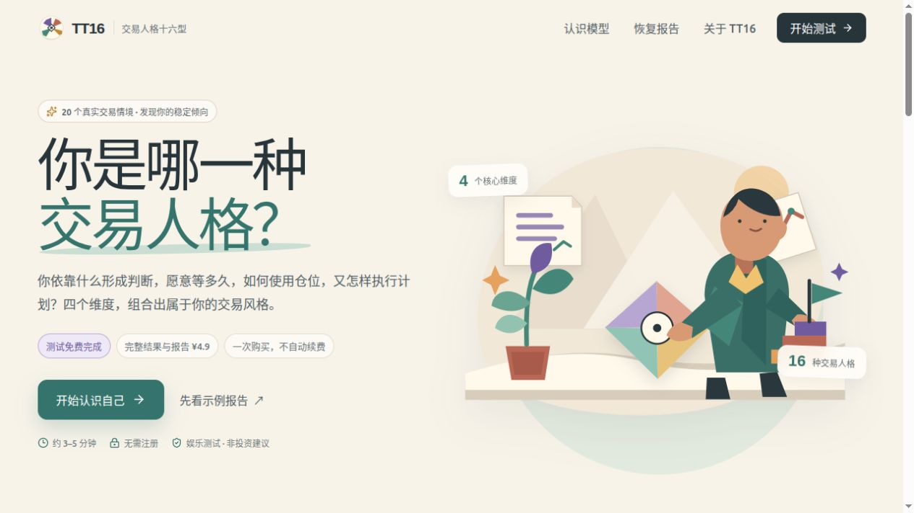
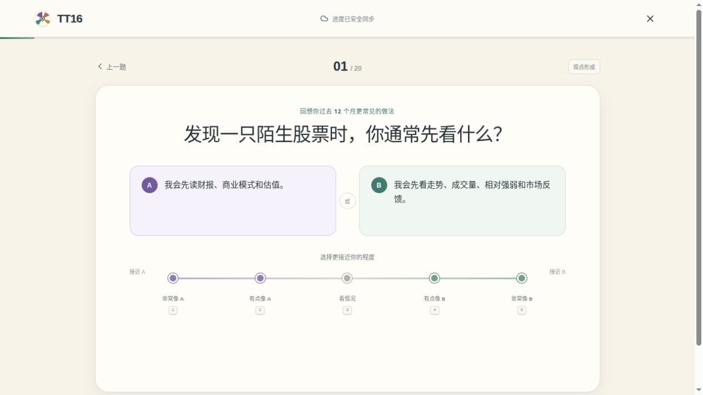
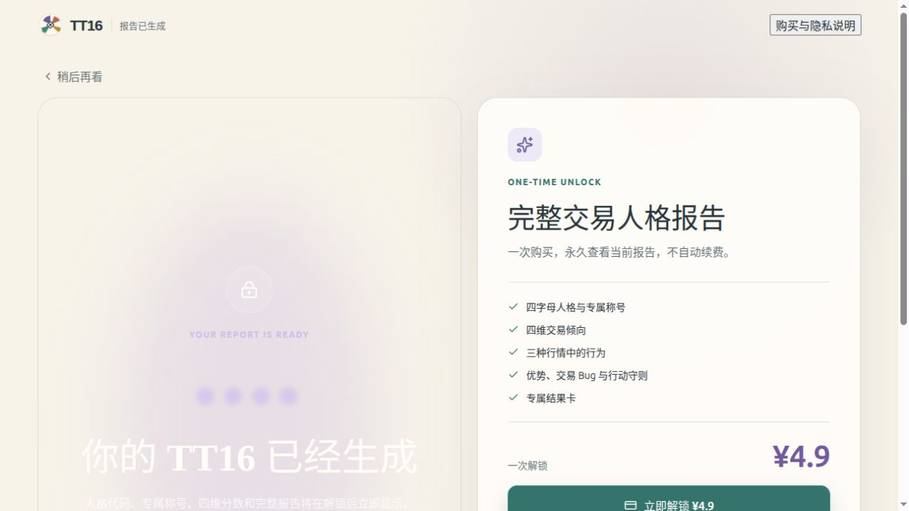
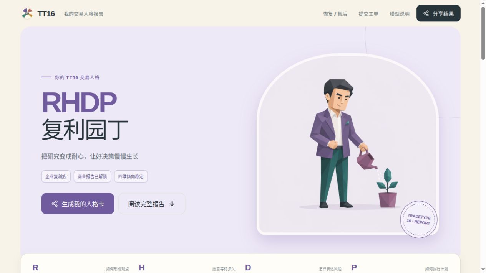
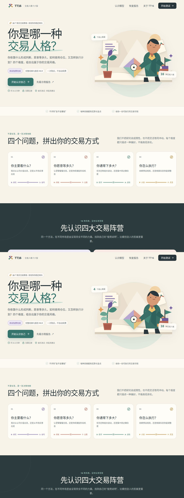
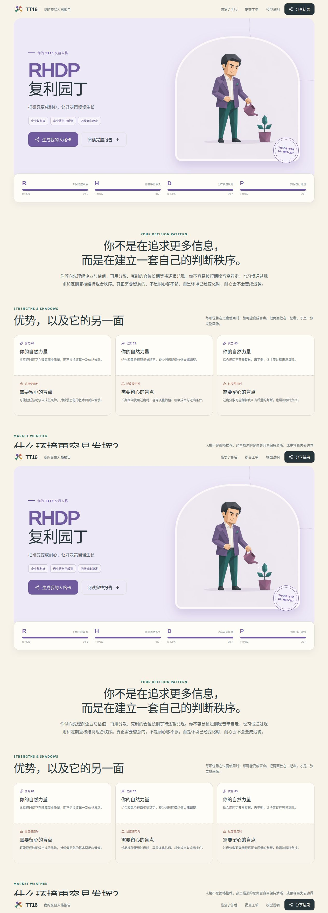
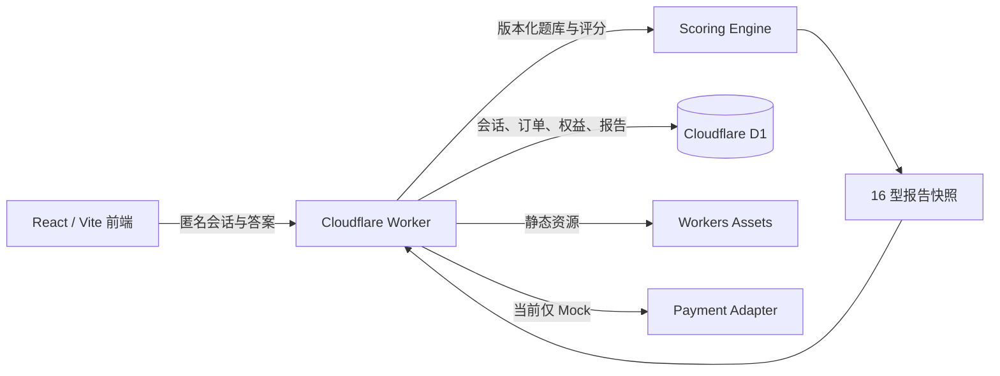

<div align="center">

# TT16 · TradeType 16

**交易人格十六型：把真实交易选择，整理成一张可复盘的决策地图。**

[在线体验](https://tt16-commercial-sandbox.samsong-1a3.workers.dev) · [参与贡献](CONTRIBUTING.md) · [安全策略](SECURITY.md) · [第三方声明](THIRD_PARTY_NOTICES.md)

> 当前在线版本使用 Mock 沙盒支付，不会产生真实扣款；结果仅用于自我观察与娱乐，不构成投资建议。

</div>


## TT16 是什么？

TT16 是一个开源、移动端优先的交易行为人格项目。用户回答 20 个贴近真实决策的情境题，系统从四组连续维度观察稳定倾向，并组合成 16 种交易风格。完整报告会解释优势、盲点、压力反应、适配环境和可执行的复盘守则。

我们借用了“十六型人格”容易理解、容易传播的表达方式，但不想把交易者贴成简单标签。TT16 更关心四个具体问题：

| 维度 | 左侧倾向 | 右侧倾向 | 我们在观察什么 |
| --- | --- | --- | --- |
| R / S | Research · 研究 | Signal · 信号 | 观点主要从企业价值还是市场反馈形成 |
| H / T | Hold · 持有 | Trade · 交易 | 更愿意等待逻辑兑现，还是捕捉阶段机会 |
| D / A | Defensive · 防守 | Aggressive · 进攻 | 更重视风险预算，还是集中表达确信度 |
| P / F | Planned · 计划 | Flexible · 灵活 | 更依赖预设规则，还是随新信息调整 |

维度没有高低，类型也不代表收益能力。它们只是描述“你通常怎样做决定”，帮助你发现一种优势在过度使用时可能变成什么盲点。

## 在线体验

**Cloudflare 商业沙盒：** [tt16-commercial-sandbox.samsong-1a3.workers.dev](https://tt16-commercial-sandbox.samsong-1a3.workers.dev)

- 测试约 3–5 分钟，无需注册，不连接券商账户；
- 20 题免费完成，当前解锁流程为 Mock 模拟支付；
- 页面会明确显示沙盒提示，点击模拟确认不会产生真实扣款；
- 在线数据仅用于演示，请勿输入个人信息、真实订单或任何密钥。

## 真实体验截图

以下图片全部截取自当前 Cloudflare 在线沙盒，不是设计稿或静态重绘。



| 回答真实情境 | 结果生成前的中性付费墙 |
| --- | --- |
|  |  |



<details>
<summary>展开查看完整首页长截图</summary>



</details>

<details>
<summary>展开查看完整人格报告长截图</summary>



</details>

## 为什么做这个项目？

交易复盘常被简化成“这笔赚了还是亏了”，但一次结果无法说明决策过程是否可靠。我们希望做一个更轻、更友好的入口：先让用户认出自己的稳定模式，再把抽象提醒翻译成具体动作。

TT16 坚持几条产品原则：

- **描述偏好，不评判能力。** 研究不天然等于理性，灵活也不天然等于冲动；
- **优势与盲点成对出现。** 每个报告都展示一种力量过度使用后的另一面；
- **从标签回到行动。** 报告最终落在可以记录、执行和复盘的守则上；
- **人格与适当性分开。** 不收集收入、负债、持仓或风险承受能力，不输出投资适当性结论；
- **不荐股，不承诺收益。** 项目不连接券商，不给出证券、仓位或买卖建议。

## 已实现能力

- 20 道版本化商业题库、四维计分、质量门与 16 型报告快照；
- Cloudflare Worker 服务端评分，前端无法自行指定分数或人格类型；
- 匿名 session、逐题同步、刷新恢复和订单凭证恢复；
- 付费前不下发人格代码、称号、维度或报告正文；
- 服务端定价、幂等订单、Mock 支付、唯一权益和高熵报告 token；
- 退款后撤销权益与访问 token，支持售后和数据权利工单；
- CSP、HSTS、来源校验、输入限制、速率限制和 D1 健康检查；
- 单元测试、Worker 类型检查与完整商业 API 验收。

## 技术架构



主要技术栈：React 19、TypeScript、Vite、Cloudflare Workers、D1、Wrangler、Vitest。

## 本地运行

需要 Node.js 22+ 和 npm。

```bash
git clone https://github.com/wzxsph/TT16.git
cd TT16
npm ci
npm run db:migrate:local
npm run dev:commercial
```

默认访问地址为 `http://127.0.0.1:8787`。本地配置使用本地 D1、`APP_ENV=local` 与 `PAYMENT_MODE=mock`。

常用检查命令：

```bash
npm run build
npm run typecheck:worker
npm test -- --run
npm run test:api:commercial
npm audit --audit-level=high
```

## 目录导览

```text
src/                         React 页面、题库、画像和评分客户端
worker/index.ts              Cloudflare Worker 商业 API
migrations/                  D1 顺序迁移
public/images/               线上使用的 16 型 WebP 插画
design/personality-masters/  人格插画 PNG 母版与设计资产
docs/images/                 README 宣传图与真实体验截图
scripts/                     资产处理与 API 验收脚本
ops/                         沙盒发布、监控与运维材料
prd/                         产品需求文档
```

## Cloudflare 沙盒部署

`wrangler.sandbox.jsonc` 指向独立沙盒 Worker 与 D1。部署前需要在自己的 Cloudflare 账户创建 D1，并替换配置中的 `database_id` 与域名：

```bash
npm run db:migrate:sandbox
npm run deploy:sandbox
```

部署后，`/api/health` 应返回 `environment=sandbox`、`paymentMode=mock` 和 `commerce=true`。项目会拒绝 `production + mock` 组合；真实支付必须使用独立生产配置、正式回调验签和 Cloudflare Secrets。

## 参与贡献

欢迎参与题目设计、内容校准、可访问性、视觉、测试、Cloudflare 工程和文档工作。请先阅读 [CONTRIBUTING.md](CONTRIBUTING.md)，再从 [Issue 模板](https://github.com/wzxsph/TT16/issues/new/choose) 选择合适入口；安全问题不要创建公开 Issue，请按 [SECURITY.md](SECURITY.md) 私下报告。

贡献时请特别保护三条边界：付费前不泄露结果、评分与价格以 Worker 为准、任何页面都不得暗示收益或提供投资建议。

## 路线图

- 用真实用户研究继续校准 20 题题库和内容效度；
- 完善中英文可访问性、移动端体验与报告导出；
- 建立可插拔支付适配层，但仅在主体、商户、合规和客服条件完备后启用；
- 补充可复现的内容版本、数据删除工具与运维可观测性；
- 探索更多“不评判能力、只描述决策过程”的行为自省工具。

## 许可证

维护者拟采用 **GNU Affero General Public License v3.0 only（AGPL-3.0-only）**：允许商用和修改，同时要求分发版本以及通过网络向用户提供的修改版公开对应源码。正式 `LICENSE` 将在维护者确认版权署名后加入；在此之前，请勿假定仓库内容已经获得开源许可授权。

## 免责声明

TT16 是行为自我观察与娱乐项目，不构成证券投资建议、收益承诺、风险承受能力评估、心理诊断或任何金融产品推荐。市场有风险，投资决策应结合个人财务状况、投资目标与独立判断。
